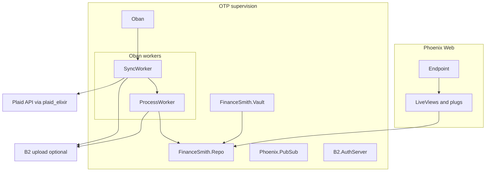

# Infrastructure and codebase map

This document describes **how Finance Smith is deployed and wired**: local PostgreSQL, external services (Plaid, Backblaze B2), OTP supervision, Ash domains, the Phoenix web layer, and the Oban-backed data lake. Use it as a **structural reference** when navigating the repository or feeding context to tools (for example a custom Gemini Gem).

**Related docs**

- [README.md](../README.md) — prerequisites, `mix ash.setup`, optional hooks and Adminer.
- [SECURITY.md](../SECURITY.md) — household/operator security policy and practices.
- [AGENT_SECURITY.md](../AGENT_SECURITY.md) — rules for developers and AI agents (secrets, Cloak, logging, dependencies).
- [priv/repo/README.md](../priv/repo/README.md) — entity-relationship diagram, indexes, cascade rules.
- [service-state-report.md](service-state-report.md) — deeper maturity and design notes (may overlap with this file).

**Secrets:** Do not commit credentials. Policy for operators is in [SECURITY.md](../SECURITY.md); coding guardrails are in [AGENT_SECURITY.md](../AGENT_SECURITY.md). This file only lists **which** environment variables exist and **where** they are read.

---

## High-level architecture



Supervision is defined in [`lib/finance_smith/application.ex`](../lib/finance_smith/application.ex).

---

## Repository layout

| Area | Path | Role |
|------|------|------|
| Domain and OTP app | [`lib/finance_smith/`](../lib/finance_smith/) | Ash domains (`Identity`, `Banking`), [`Vault`](../lib/finance_smith/vault.ex), data lake (`DataLake.*`), [`Repo`](../lib/finance_smith/repo.ex), [`Application`](../lib/finance_smith/application.ex) |
| Web | [`lib/finance_smith_web/`](../lib/finance_smith_web/) | Endpoint, router, LiveViews, plugs, controllers, layouts, Petal-oriented components |
| Configuration | [`config/`](../config/) | `config.exs` loads `.env` in dev/test; `runtime.exs` enforces prod secrets |
| Database | [`priv/repo/`](../priv/repo/) | Migrations, ERD README |
| Frontend assets | [`assets/`](../assets/) | JS/CSS pipeline (esbuild, Tailwind) |
| Tests | [`test/`](../test/) | Feature and integration tests |
| Compose | [`compose.yaml`](../compose.yaml) | PostgreSQL 17 service; optional Adminer profile |

---

## Runtime (OTP)

Processes started by [`FinanceSmith.Application`](../lib/finance_smith/application.ex):

| Child | Responsibility |
|-------|----------------|
| `FinanceSmith.Repo` | PostgreSQL via Ecto/AshPostgres |
| `FinanceSmith.Vault` | Cloak AES-GCM vault for encrypted Ash attributes |
| `Phoenix.PubSub` | Real-time and LiveView messaging |
| `FinanceSmith.DataLake.B2.AuthServer` | Holds B2 auth token in memory; refreshes on 401 |
| `Oban` | Background jobs (`:data_lake` queue, pruner plugin) |
| `FinanceSmithWeb.Endpoint` | HTTP server (Bandit), sessions, LiveView |

---

## Ash domains and resources

Domains are registered in [`config/config.exs`](../config/config.exs) as `ash_domains: [FinanceSmith.Identity, FinanceSmith.Banking]`.

| Domain | Module | Resources | Primary concern |
|--------|--------|-----------|-----------------|
| Identity | [`lib/finance_smith/identity.ex`](../lib/finance_smith/identity.ex) | `Household`, `User` | Registration, sign-in, MFA-related actions; code interface helpers on the domain |
| Banking | [`lib/finance_smith/banking.ex`](../lib/finance_smith/banking.ex) | `PlaidItem`, `Account`, `Transaction` | Plaid-linked items, accounts, normalized transactions |

**Encryption (summary):** [`FinanceSmith.Vault`](../lib/finance_smith/vault.ex) backs **AshCloak** on sensitive fields (for example Plaid access tokens and MFA-related user fields). Key material comes from `CLOAK_KEY`. Operational constraints (when to load decrypted values, logging bans) are in [SECURITY.md](../SECURITY.md) and [AGENT_SECURITY.md](../AGENT_SECURITY.md).

---

## Web layer

Routing and pipelines live in [`lib/finance_smith_web/router.ex`](../lib/finance_smith_web/router.ex).

| Concern | Detail |
|---------|--------|
| Browser stack | Session, CSRF, flash, root layout, [`UserAuth`](../lib/finance_smith_web/user_auth.ex) |
| Public | `/` (home), `/users/log_in`, `/users/register`, session POST/DELETE — [`UserLoginLive`](../lib/finance_smith_web/live/user_login_live.ex), [`UserRegistrationLive`](../lib/finance_smith_web/live/user_registration_live.ex) |
| MFA pending | `/users/mfa/*` under `RequireMfaPending` and `LiveAuth :mfa_pending` — [`MfaVerifyLive`](../lib/finance_smith_web/live/mfa_verify_live.ex) |
| Authenticated + MFA verified | `/dashboard`, `/users/settings`, `/users/settings/mfa` — plugs `RequireAuthenticated`, `RequireMfaVerified`, `LiveAuth :default` — [`DashboardLive`](../lib/finance_smith_web/live/dashboard_live.ex), [`UserSettingsLive`](../lib/finance_smith_web/live/user_settings_live.ex), [`MfaSetupLive`](../lib/finance_smith_web/live/mfa_setup_live.ex) |

There is **no** Plaid or B2 webhook HTTP route in the router today; sync is driven on demand (Oban), not by inbound webhooks.

---

## Background processing and data lake

Configured in [`config/config.exs`](../config/config.exs): **Oban** uses `FinanceSmith.Repo`, queue **`data_lake`** (concurrency **5**), and **`Oban.Plugins.Pruner`** (completed/discarded jobs older than 7 days).

### SyncWorker

[`lib/finance_smith/data_lake/sync_worker.ex`](../lib/finance_smith/data_lake/sync_worker.ex)

- **Enqueue:** `FinanceSmith.DataLake.SyncWorker.enqueue(plaid_item_id)` — internal UUID of the `PlaidItem`. Jobs are **unique** per item for a short window to avoid duplicate runs.
- Calls Plaid **transactions sync** in a cursor-based loop; persists **`plaid_items.next_cursor`** on success.
- For each page: attempts archive via [`Uploader`](../lib/finance_smith/data_lake/uploader.ex); on **successful** B2 upload, enqueues **`ProcessWorker`** with the object key so DB writes run asynchronously.
- If B2 upload fails or B2 is not authenticated in dev, processes the **in-memory** payload so transactions still land.

### ProcessWorker and TransactionProcessor

[`lib/finance_smith/data_lake/process_worker.ex`](../lib/finance_smith/data_lake/process_worker.ex) downloads JSON (when given a B2 key) or uses supplied payload; [`TransactionProcessor`](../lib/finance_smith/data_lake/transaction_processor.ex) upserts or removes transactions using Plaid-stable identities.

**Replay / backfill** a specific archived object:

```elixir
FinanceSmith.DataLake.ProcessWorker.enqueue("plaid_sync/{household_uuid}/{plaid_item_id}/2026/03/{timestamp}.json")
```

### B2 object keys

[`lib/finance_smith/data_lake/key_builder.ex`](../lib/finance_smith/data_lake/key_builder.ex) builds:

`plaid_sync/{household_id}/{plaid_item_id}/{YYYY}/{MM}/{timestamp}.json`

- `household_id` — UUID of the household (via loaded `user.household`).
- `plaid_item_id` — **Plaid’s** item id string, not the internal Ash UUID.

---

## Local PostgreSQL (Docker Compose)

From the repo root:

```bash
docker compose up -d
```

[`compose.yaml`](../compose.yaml) runs **PostgreSQL 17** as service `db` with:

- **`network_mode: host`** — the database listens on the host’s Postgres port (default **5432**); there is no bridge port mapping. This avoids veth issues in some WSL2/VM setups.
- **Healthcheck** via `pg_isready`.
- **Volume** `postgres_data` for data.
- **Init script** mounted from [`docker/scripts/init-test-db.sh`](../docker/scripts/init-test-db.sh) to create the test database name from `POSTGRES_TEST_DB`.

**Optional Adminer** (database UI):

```bash
docker compose --profile debug up -d
```

Adminer is published on **8080**. With host networking on `db`, point Adminer at **`host.docker.internal`** (see `extra_hosts` on the `adminer` service).

**External or managed PostgreSQL:** set `POSTGRES_*` variables as in [README.md](../README.md); no code changes required for the app to use another host.

---

## External integrations

### Plaid

- **Library:** `plaid_elixir` (configured as `:plaid` in Mix).
- **Dev/sandbox:** [`config/config.exs`](../config/config.exs) — `root_uri` sandbox URL; `client_id` / `secret` from `PLAID_CLIENT_ID` / `SANDBOX_PLAID_SECRET`.
- **Production:** [`config/runtime.exs`](../config/runtime.exs) — `https://production.plaid.com/` and **required** `PLAID_CLIENT_ID` / `PRODUCTION_PLAID_SECRET` (raises if missing).

Wrapper module: [`lib/finance_smith/banking/plaid.ex`](../lib/finance_smith/banking/plaid.ex).

### Backblaze B2 (provisioning)

The app archives **raw Plaid sync JSON** to a private B2 bucket (server-side encryption at the bucket level). No AWS services are required for the core pipeline.

#### Create the bucket

1. Log in to the [Backblaze B2 Console](https://secure.backblaze.com/b2_buckets.htm).
2. Create a new **private** bucket.
3. Leave **Default Encryption** enabled.
4. Under **Lifecycle Settings**, set files to **Keep all versions** if you want an immutable-style archive (within your tier limits).

#### Create a scoped application key

1. **App Keys** → **Add a New Application Key**.
2. **Allow access to Bucket(s):** only the archive bucket.
3. **Type of Access:** **Read and Write** (minimum for upload + `ProcessWorker` download).
4. Copy into `.env`:

```
B2_KEY_ID=<keyID>
B2_APP_KEY=<applicationKey>
B2_KEY_NAME=<keyName>
B2_BUCKET_NAME=<bucketName>
```

`B2_KEY_NAME` is informational for operators; the app reads `B2_KEY_ID`, `B2_APP_KEY`, and `B2_BUCKET_NAME` from the environment (see [`config/dev.exs`](../config/dev.exs) and prod [`runtime.exs`](../config/runtime.exs)).

#### File permissions on the deployment host

```bash
chmod 600 /path/to/.env
```

Restrict reads to the OS user running the release.

#### Development without B2

In dev, empty B2 settings default to `""` in [`config/dev.exs`](../config/dev.exs). **`B2.AuthServer`** will not authenticate; **sync still processes transactions** from memory. Production **`runtime.exs`** requires B2 variables.

---

## Environment variables (summary)

Align with [`.env.example`](../.env.example). Production-only requirements are enforced in [`config/runtime.exs`](../config/runtime.exs).

| Variable | Used for |
|----------|-----------|
| `COMPOSE_PROJECT_NAME` | Docker Compose project name |
| `POSTGRES_USER`, `POSTGRES_PASSWORD`, `POSTGRES_HOST`, `POSTGRES_PORT` | DB connection (dev/test via `dev.exs` / `test.exs`) |
| `POSTGRES_DB`, `POSTGRES_TEST_DB` | Dev and test database names |
| `POSTGRES_POOL_SIZE` | Pool size in dev |
| `DATABASE_URL`, `POOL_SIZE` | **Production** repo URL and pool ([`runtime.exs`](../config/runtime.exs)) |
| `CLOAK_KEY`, `CLOAK_KEY_TEST` | Vault / AshCloak (dev and test respectively where configured) |
| `SECRET_KEY_BASE`, `SECRET_KEY_BASE_TEST` | Phoenix session signing (dev/test); **`SECRET_KEY_BASE`** required in prod |
| `PORT` | HTTP port in prod (default 4000) |
| `PLAID_CLIENT_ID`, `SANDBOX_PLAID_SECRET` | Plaid API (dev/test sandbox) |
| `PLAID_CLIENT_ID`, `PRODUCTION_PLAID_SECRET` | Plaid API (production) |
| `B2_KEY_ID`, `B2_APP_KEY`, `B2_BUCKET_NAME` | B2 API (required in prod `runtime.exs`) |
| `B2_KEY_NAME` | Optional operator label (not required by app config) |

---

## Intentional gaps (do not assume these exist)

The codebase evolves; the following are **not** fully implemented or not present as of this map—check git for changes before relying on them:

- **SimpleFIN** — mentioned in product docs; no client module or ingestion path in `lib/`.
- **Plaid Link in the UI** — server-side Plaid helpers may exist; **no** LiveView/controller flow is wired for “connect bank” end-to-end in the dashboard shell.
- **Plaid webhooks** — no verified webhook endpoint in the router; sync is **on-demand** via Oban.
- **Rich dashboard product** — filtering/grouping by institution, account type, and time grain as described in the README is **not** fully realized in the current dashboard UI.
- **B2 purge on `PlaidItem` delete** — database cascades exist; **object-store** cleanup under `plaid_sync/...` is not described as implemented here.

If you implement any of the above, update this document and [SECURITY.md](../SECURITY.md) / [AGENT_SECURITY.md](../AGENT_SECURITY.md) when security posture changes.
