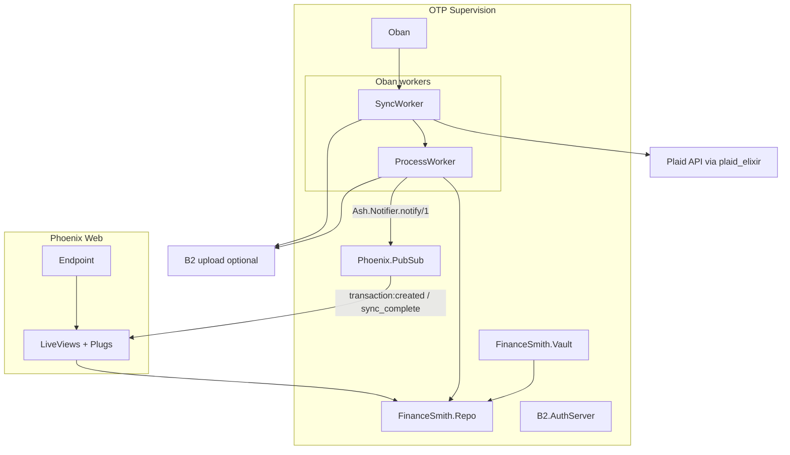

# Finance Smith — service state report

This document captures the current architecture, design choices, dependencies, and maturity of the Finance Smith codebase. It reflects the repository as of **April 2026**; regenerate or amend when major areas land.

---

## Purpose (intent vs code)

Per [README.md](../README.md) and [.cursorrules](../.cursorrules), the product goal is a **self-hosted household financial dashboard**: aggregate Plaid/SimpleFIN data, normalize it in Postgres, and expose **dense tables with filtering/grouping** and future analytics.

**Implemented today:** PostgreSQL + Ash domains for households/users and Plaid-shaped banking entities; **Plaid API wrapper** ([`lib/finance_smith/banking/plaid.ex`](../lib/finance_smith/banking/plaid.ex)); **end-to-end Plaid Link flow** (link token → public token exchange → accounts seeded → sync enqueued) wired into [`DashboardLive`](../lib/finance_smith_web/live/dashboard_live.ex); **cursor-based transaction sync** with Oban ([`SyncWorker`](../lib/finance_smith/data_lake/sync_worker.ex), [`ProcessWorker`](../lib/finance_smith/data_lake/process_worker.ex), [`TransactionProcessor`](../lib/finance_smith/data_lake/transaction_processor.ex)); **live recent-transactions table** (last 50, sorted by date) with PubSub-driven refresh; **`complete_sync` action** that sets `last_synced_at` on `PlaidItem` and broadcasts a sync-complete toast; **optional Backblaze B2** raw JSON archive ([`DataLake.B2`](../lib/finance_smith/data_lake/b2.ex), [`B2.AuthServer`](../lib/finance_smith/data_lake/b2/auth_server.ex)); **full auth stack** (registration, session, TOTP MFA, lockout) with Phoenix LiveView and plugs.

**Not yet implemented / aspirational:** **SimpleFIN** appears only in README / [SECURITY.md](../SECURITY.md) / docs, not as a dependency or module. **No Plaid webhook route** in [`router.ex`](../lib/finance_smith_web/router.ex); sync is on-demand (Oban) or user-initiated. **Filtering/grouping** by institution, account type, and time grain as described in the README is not yet reflected in the dashboard UI — the ledger shows raw recent transactions without aggregation or filter controls.

---

## Runtime architecture

Supervision tree is defined in [`lib/finance_smith/application.ex`](../lib/finance_smith/application.ex): `Repo`, `Vault`, `PubSub`, `B2.AuthServer`, `Oban`, `Endpoint`.

---

## Domain and data model

Two Ash domains are registered in [`config/config.exs`](../config/config.exs):

| Domain | Resources | Notes |
|--------|-----------|--------|
| `FinanceSmith.Identity` | `Household`, `User` | Registration, sign-in read, MFA actions; code interface helpers on domain ([`identity.ex`](../lib/finance_smith/identity.ex)). |
| `FinanceSmith.Banking` | `PlaidItem`, `Account`, `Transaction` | Plaid-centric schema; documented ERD in [priv/repo/README.md](../priv/repo/README.md). |

**Encryption:** AshCloak + Cloak vault ([`vault.ex`](../lib/finance_smith/vault.ex)) — `PlaidItem.access_token`, `User.mfa_secret` / `recovery_codes`. Keys from `CLOAK_KEY` (prod enforced in [`config/runtime.exs`](../config/runtime.exs)).

**Banking domain** now has code interface `define` entries in [`banking.ex`](../lib/finance_smith/banking.ex):

| Function | Action |
|----------|--------|
| `create_plaid_item_from_public_token/2` | `PlaidItem :create_from_public_token` |
| `complete_plaid_item_sync/1` | `PlaidItem :complete_sync` |
| `list_recent_transactions/1` | `Transaction :for_dashboard` |

---

## Web layer and UX design

- **Router** ([`router.ex`](../lib/finance_smith_web/router.ex)): public login/register; MFA pending session; authenticated session for `/dashboard`, settings, MFA setup.
- **Design system:** PetalComponents + Tailwind; project rules enforce dark `bg-gray-950` / `border-gray-800`, `font-mono` for money, subtle Matrix tone in empty copy (visible on dashboard).
- **Home** ([`page_controller.ex`](../lib/finance_smith_web/controllers/page_controller.ex)): redirect logged-in users to `/dashboard`, others to login.

---

## Background processing and data lake

- **Oban** ([`config/config.exs`](../config/config.exs)): queue `:data_lake` (concurrency 5), pruner plugin.
- **SyncWorker** pulls Plaid `/transactions/sync`, updates `next_cursor`, uploads raw JSON to B2 when authenticated; on upload failure or missing B2 auth, **processes in memory** so transactions still land ([`sync_worker.ex`](../lib/finance_smith/data_lake/sync_worker.ex)). On completion of all pages, calls the `:complete_sync` action which sets `last_synced_at` on `PlaidItem` and publishes a `"plaid_item:sync_complete:{user_id}"` PubSub event.
- **ProcessWorker** / **TransactionProcessor** upsert or remove transactions by Plaid identity; supports processing from B2 key path for replay/backfill. `TransactionProcessor` uses `return_notifications?: true` during upserts and calls `Ash.Notifier.notify/1` **after** the `Repo.transaction` commits — this deferred flush ensures the `"transaction:created"` PubSub messages reach subscribers without missed-notification warnings.
- **B2** in dev: empty env vars default to `""`; `AuthServer` logs failure and stays unauthenticated — app still starts ([`config/dev.exs`](../config/dev.exs), [`auth_server.ex`](../lib/finance_smith/data_lake/b2/auth_server.ex)).
For B2 bucket and key setup, see [infrastructure.md](infrastructure.md).

---

## Dependencies (from [`mix.exs`](../mix.exs))

| Area | Packages |
|------|----------|
| Core / DB | `ash`, `ash_postgres`, `ash_phoenix`, `ash_cloak`, `cloak` |
| Web | `phoenix`, `phoenix_live_view`, `phoenix_html`, `bandit`, `petal_components`, `heroicons`, `esbuild` |
| Integrations | `plaid` (hex: `plaid_elixir`), `req` |
| Jobs | `oban` |
| Auth / crypto | `bcrypt_elixir`, `nimble_totp`, `eqrcode` |
| Dev / codegen | `igniter`, `usage_rules`, `phoenix_live_reload`, `sourceror`, `simple_sat`, `lazy_html` |

**Elixir:** `~> 1.19`. **Not listed:** SimpleFIN client library.

---

## Configuration and secrets

- **Dev/test:** [`config/config.exs`](../config/config.exs) loads `.env` into `System.get_env` before other config (non-destructive if already set).
- **Plaid:** sandbox URL in default dev/test config (`PLAID_CLIENT_ID` / `SANDBOX_PLAID_SECRET`). In production, [`config/runtime.exs`](../config/runtime.exs) branches on `PLAID_ENV`:
  - `PLAID_ENV` unset or `production` (default) → `https://production.plaid.com/` + required `PRODUCTION_PLAID_SECRET`.
  - `PLAID_ENV=sandbox` → `https://sandbox.plaid.com/` + required `SANDBOX_PLAID_SECRET`. Useful for staging prod-mode containers.
- **Reference env:** [`.env.example`](../.env.example) — Postgres, `CLOAK_KEY*`, `SECRET_KEY_BASE*`, `PLAID_ENV`, Plaid credentials, B2.

---

## Testing

Focused tests under `test/` cover plugs, session controller, MFA setup LiveView, identity user actions, Plaid wrapper, data lake key builder/uploader, and B2 integration. Dashboard and Plaid item tests are present ([`dashboard_live_test.exs`](../test/finance_smith_web/live/dashboard_live_test.exs), [`plaid_item_test.exs`](../test/finance_smith/banking/plaid_item_test.exs)) including expectations for `get_accounts` mock calls after public token exchange. Broad end-to-end sync and filtering/aggregation tests are not yet in place.

---

## Summary maturity assessment

| Layer | Maturity |
|-------|----------|
| Schema / Ash resources | **Strong** — documented, FK rules, partition-ready transaction identity |
| Plaid integration (server-side) | **Strong** — sync loop, processor, encryption |
| Auth / MFA | **Strong** — policies, lockout, LiveView flows |
| Product UI (ledger, integrations) | **Partial** — live recent-transactions table, Plaid Link connect flow, PubSub refresh; filtering/grouping not yet built |
| SimpleFIN | **Not started** |
| B2 archive | **Optional but integrated** — graceful degradation |
| Observability / analytics | **Minimal** — telemetry deps present; not central to this report |

This is best characterized as **Phase 3 in progress**: Plaid ETL infrastructure is complete, the end-to-end connect flow is live, and the dashboard shows real transaction data. Filtering, aggregation, and multi-provider support remain ahead.
