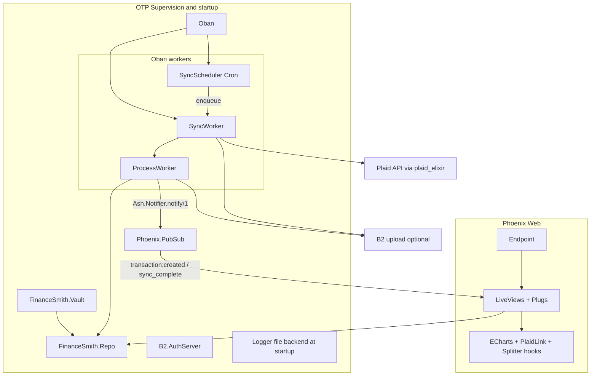

# Finance Smith — service state report

This document captures the current architecture, design choices, dependencies, and maturity of the Finance Smith codebase. It reflects the repository as of **May 2026**; regenerate or amend when major areas land.

---

## Purpose (intent vs code)

Per [README.md](../README.md) and [.cursorrules](../.cursorrules), the product goal is a **self-hosted household financial dashboard**: aggregate Plaid/SimpleFIN data, normalize it in Postgres, and expose **dense tables with filtering and grouping** and future analytics.

**Implemented today:** PostgreSQL + Ash domains for households/users and Plaid-shaped banking entities; **Plaid API wrapper** ([`lib/finance_smith/banking/plaid.ex`](../lib/finance_smith/banking/plaid.ex)); **end-to-end Plaid Link** and **Plaid OAuth** (link token → public token exchange → accounts seeded → sync enqueued) via [`DashboardLive`](../lib/finance_smith_web/live/dashboard_live.ex) and [`OAuthCallbackLive`](../lib/finance_smith_web/live/oauth_callback_live.ex); **keyset-paginated transaction list** (25 per page) with **date range, household meta-category, and merchant search** filters, **column sort**, and **URL query params** — shared by [`TransactionTableComponent`](../lib/finance_smith_web/live/components/transaction_table_component.ex) on the dashboard, [`ConnectionLive`](../lib/finance_smith_web/live/connection_live.ex) (per Plaid item), and [`AccountLive`](../lib/finance_smith_web/live/account_live.ex) (per account). **KPI tiles** and **view scope** (household / personal / per institution) with **Postgres-backed aggregates** on `User`, `Household`, and `PlaidItem`; **cashflow line chart and outflow pie chart** grouped by meta category (ECharts via client hooks). **Cursor-based Plaid transaction sync** with Oban ([`SyncWorker`](../lib/finance_smith/data_lake/sync_worker.ex), [`ProcessWorker`](../lib/finance_smith/data_lake/process_worker.ex), [`TransactionProcessor`](../lib/finance_smith/data_lake/transaction_processor.ex)); **periodic sync** via [`SyncScheduler`](../lib/finance_smith/data_lake/sync_scheduler.ex) (Oban Cron). PubSub-driven **live refresh** on new transactions and sync completion. **`complete_sync` action** on `PlaidItem` sets `last_synced_at` and broadcasts sync-complete. **Optional Backblaze B2** raw JSON archive ([`DataLake.B2`](../lib/finance_smith/data_lake/b2.ex), [`B2.AuthServer`](../lib/finance_smith/data_lake/b2/auth_server.ex)). **Full auth stack** — registration (including **join an existing household**), session, TOTP MFA, lockout — with Phoenix LiveView and plugs. Helpers: [`MoneyFormat`](../lib/finance_smith_web/money_format.ex) (integer cents); [`MetaCategory`](../lib/finance_smith/banking/meta_category.ex), [`CategoryMapping`](../lib/finance_smith/banking/category_mapping.ex), and [`CategoryResolution`](../lib/finance_smith/banking/category_resolution.ex) normalize Plaid PFC tokens into a household taxonomy.

**Not yet implemented / aspirational:** **SimpleFIN** — documented only, no dependency or module. **No inbound Plaid webhook route** in [`router.ex`](../lib/finance_smith_web/router.ex) (outbound `sandbox fire_webhook` test helpers exist; sync is Oban- and user-driven). **Gaps vs README vision:** no **per-account-type** grouping in the UI, no **time-grain bucketing** (weekly/monthly) in tables, and no household UI for reviewing or remapping category mappings yet.

---

## Runtime architecture

`LoggerBackends` adds a **rotating file backend** for warnings+ when enabled ([`application.ex`](../lib/finance_smith/application.ex) — not a supervised child, registered at app start). Supervision children: `Repo`, `Vault`, `PubSub`, `B2.AuthServer`, `Oban`, `Endpoint`.

---

## Domain and data model

Two Ash domains are registered in [`config/config.exs`](../config/config.exs):

| Domain | Resources | Notes |
|--------|-----------|--------|
| `FinanceSmith.Identity` | `Household`, `User` | `register`, `register_and_join`, sign-in, MFA, lockout; KPI loads via `get_*_with_kpis` ([`identity.ex`](../lib/finance_smith/identity.ex)). |
| `FinanceSmith.Banking` | `PlaidItem`, `Account`, `Transaction` | Plaid-centric schema; migrations and ERD notes in [priv/repo/REPO_README.md](../priv/repo/REPO_README.md). |

**Encryption:** AshCloak + Cloak vault ([`vault.ex`](../lib/finance_smith/vault.ex)) — `PlaidItem.access_token`, `User.mfa_secret` / `recovery_codes`. Keys from `CLOAK_KEY` (prod enforced in [`config/runtime.exs`](../config/runtime.exs)).

**Authorization:** `PlaidItem`, `Account`, and `Transaction` read policies allow **own items** or **same household** (via PlaidItem → User). User-facing creates for Plaid are limited to `create_from_public_token`; system sync uses `authorize?: false` where required.

**Aggregates and KPIs:** `User` and `Household` expose `total_assets`, `total_liabilities`, `outflow_30d`, `inflow_30d`, and active Plaid stream counts; `PlaidItem` exposes per-item KPI sums/counts for dashboard tiles. Calculations such as `total_net_worth` are expression-based on loaded aggregates.

**`Account`:** `status` (`AccountStatus`), optional `duplicate_of` self-reference for deduplication; `:read_for_ui` excludes soft-linked duplicates (default `:read` is system-facing). **`Transaction`:** custom indexes (including GIN on `metadata`, category and date composites); default `:read` is system-facing (no duplicate-account filter); UI reads `:list` (keyset, filters) and `:for_chart` (capped row window) exclude transactions on accounts with `duplicate_of_id` set. **`MetaCategory`** and **`CategoryMapping`** provide the household-scoped taxonomy; filter dropdowns are populated from `MetaCategory` rather than from `Transaction` directly.

**Banking** code interfaces in [`banking.ex`](../lib/finance_smith/banking.ex):

| Function | Action / notes |
|----------|------------------|
| `create_plaid_item_from_public_token/2` | `PlaidItem :create_from_public_token` |
| `complete_plaid_item_sync/1` | `PlaidItem :complete_sync` |
| `get_plaid_item_by_id/1` | `PlaidItem` primary `:read`, `get_by: [:id]` — **includes decryptable `access_token`; use only in system/test contexts** |
| `get_plaid_item_summary_by_id/1` | `PlaidItem :read_for_ui` — excludes `access_token`; prefer for all LiveViews |
| `list_active_plaid_items/0` | `PlaidItem :list_active` — excludes `access_token`; prefer for listings |
| `get_plaid_item_kpis/1` | `PlaidItem` primary `:read` with KPI aggregate loads — **includes decryptable `access_token`; use only in system contexts** |
| `get_account_by_id/1` | `Account :read_for_ui`, `get_by: [:id]` — excludes soft-linked duplicate accounts; prefer for LiveViews |
| `list_transactions/1` | `Transaction :list` (keyset, filterable) — excludes transactions on duplicate-linked accounts |
| `list_meta_categories/1` | `MetaCategory :read` — household-scoped category list for filter dropdowns |
| `list_transactions_for_chart/1` | `Transaction :for_chart` — excludes transactions on duplicate-linked accounts |

**Identity** code interfaces in [`identity.ex`](../lib/finance_smith/identity.ex):

| Function | Action / notes |
|----------|----------------|
| `register/2` | `User :register` |
| `register_and_join/4` | `User :register_and_join` (join existing household) |
| `sign_in/2` | `User :sign_in` |
| `generate_mfa_secret/1`, `enable_mfa/2`, `verify_mfa_login/2`, `record_failed_login/1`, `clear_auth_lockout/1` | respective MFA/lockout actions |
| `get_household_with_kpis/1` | `Household` read with aggregate loads |
| `get_user_with_kpis/1` | `User` read with aggregate loads |

`verify_sign_in/2` is a domain helper (not a `define`) wrapping password verification and lockout.

---

## Web layer and UX design

- **Router** ([`router.ex`](../lib/finance_smith_web/router.ex)): public login/register; MFA pending; authenticated routes for `/dashboard`, `/connections/:plaid_item_id`, `/accounts/:account_id`, `/users/settings`, `/users/settings/mfa`, `/oauth/callback/plaid`. [`UserAuth`](../lib/finance_smith_web/user_auth.ex) and plugs: `RequireAuthenticated`, `RequireMfaVerified`, `RequireMfaPending`, [`LiveAuth`](../lib/finance_smith_web/plugs/live_auth.ex) `on_mount`. **Endpoint** uses `RemoteIp` and standard Phoenix plugs ([`endpoint.ex`](../lib/finance_smith_web/endpoint.ex)).
- **Design system:** PetalComponents + Tailwind; dark `bg-gray-950` / `border-gray-800`, `font-mono` for money, Agent Smith microcopy on errors/empty states.
- **Home** ([`page_controller.ex`](../lib/finance_smith_web/controllers/page_controller.ex)): redirect logged-in users to `/dashboard`, others to login.
- **Dashboard:** KPIs, scope selector, timeframe tabs (1W–All), ECharts **Inflow vs Outflow** and **Outflow Categories**, `TransactionTableComponent` with global/household/personal/institution scoping via `TransactionLiveHelpers` + `Banking` filters.
- **Connection / account pages:** read-only header (institution or account) + scoped table.
- **Helpers:** [`TransactionLiveHelpers`](../lib/finance_smith_web/live/transaction_live_helpers.ex) for query params, sort maps, and `fetch_transactions/3`. Embedded HEEx only (no separate `.heex` files for LiveViews). [`ErrorHTML`](../lib/finance_smith_web/components/error_html.ex) for 404/500 `render/2` ([`config/config.exs`](../config/config.exs) `render_errors`).

---

## Background processing and data lake

- **Oban** ([`config/config.exs`](../config/config.exs)): schema prefix `"machine"`, queue `:data_lake` (concurrency 5), **Pruner** plugin, **Cron** `*/30 * * * *` → [`SyncScheduler`](../lib/finance_smith/data_lake/sync_scheduler.ex) (fans out `SyncWorker.enqueue/1` for each active `PlaidItem`; `SyncWorker` uniqueness dedupes overlapping runs).
- **Sync:** both **on connect** (Plaid Link success) and **on schedule** (cron). Items not in `:active` (e.g. login required) are skipped by `list_active`.
- **SyncWorker** — Plaid `/transactions/sync`, `next_cursor`, B2 upload when configured; in-memory process path if B2 unavailable; `:complete_sync` at end of a full run.
- **ProcessWorker** / **TransactionProcessor** — upsert/remove by Plaid transaction id; B2 replay path; `return_notifications?: true` and `Ash.Notifier.notify/1` after commit for reliable PubSub.
- **B2** in dev: optional empty env — app starts without B2. **Production** [`config/runtime.exs`](../config/runtime.exs) **requires** `B2_KEY_ID`, `B2_APP_KEY`, and `B2_BUCKET_NAME`. See [infrastructure.md](infrastructure.md).

---

## Dependencies (from [`mix.exs`](../mix.exs))

| Area | Packages |
|------|----------|
| Core / DB | `ash`, `ash_postgres`, `ash_phoenix`, `ash_cloak`, `cloak`, `simple_sat` |
| Web | `phoenix`, `phoenix_live_view`, `phoenix_html`, `bandit`, `petal_components`, `heroicons`, `esbuild` |
| Integrations | `plaid` (hex: `plaid_elixir`), `req` |
| Jobs | `oban` |
| Auth / crypto | `bcrypt_elixir`, `nimble_totp`, `eqrcode` |
| Cluster / HTTP / i18n | `remote_ip`, `dns_cluster`, `jason`, `gettext` |
| Telemetry / logging | `telemetry_metrics`, `telemetry_poller`, `logger_file_backend`, `logger_backends` |
| Dev / codegen / test | `igniter`, `usage_rules`, `phoenix_live_reload`, `sourceror`, `lazy_html`, `mox` |

**Client (npm):** ECharts and related assets under `assets/` (bundled for charts). **Elixir:** `~> 1.19`. **Not listed:** SimpleFIN client library.

---

## Configuration and secrets

- **Dev/test:** [`config/config.exs`](../config/config.exs) loads `.env` before other config (non-destructive if already set).
- **Plaid:** sandbox defaults in base config (`PLAID_CLIENT_ID` / `SANDBOX_PLAID_SECRET`, extended `recv_timeout`). Production: [`config/runtime.exs`](../config/runtime.exs) branches on `PLAID_ENV` for sandbox vs production host and secret.
- **Logging:** `LOG_DIR` (default `logs`) for [`runtime.exs`](../config/runtime.exs) file path; `:error_log` backend `max_bytes` / `keep` in config; `enable_logger_file_backend` can be disabled in test.
- **Reference env:** [`.env.example`](../.env.example) — Postgres, `CLOAK_KEY*`, `SECRET_KEY_BASE*`, `PLAID_ENV`, Plaid credentials, B2, optional tunnel token.

---

## Testing

The suite under `test/` includes Plaid and banking resource tests, **household read policies** ([`policies_test.exs`](../test/finance_smith/banking/policies_test.exs)), transaction categories, [`TransactionLiveHelpers` coverage](../test/finance_smith_web/live/transaction_live_helpers_test.exs), [`MoneyFormat`](../test/finance_smith_web/money_format_test.exs), data lake (key builder, uploader, B2, **SyncScheduler**, transaction processing), identity (`User`, registration and join), plugs, session controller, MFA and registration LiveViews, dashboard and OAuth callback tests (including **integration** tests where tagged), [`ErrorHTML` / Ash errors](../test/finance_smith_web/ash_error_html_test.exs), and [`banking_fixtures`](../test/support/banking_fixtures.ex) for shared data. Oban is **`:manual`** in test ([`config/test.exs`](../config/test.exs)). **No project CI config** (e.g. GitHub Actions) in-repo; run `mix test` locally or in your pipeline.

---

## Summary maturity assessment

| Layer | Maturity |
|-------|----------|
| Schema / Ash resources | **Strong** — policies, indexes, identity on `plaid_transaction_id`, aggregates for KPIs |
| Plaid integration (server-side) | **Strong** — sync loop, OAuth + Link, periodic scheduler, processor, encryption |
| Auth / MFA | **Strong** — policies, lockout, registration + household join, LiveView flows |
| Product UI (ledger, charts, integrations) | **Strong** — keyset ledger with filters and sorts, KPIs, scope and charts, connection/account drill-downs |
| SimpleFIN | **Not started** |
| B2 archive | **Optional but integrated** — graceful degradation in dev |
| Observability / analytics | **Improved** — file logging with rotation, telemetry packages; product analytics not a focus of this app yet |

This is best characterized as **Phase 4 in progress**: Plaid ETL and household-aware reads are in place, the dashboard is a data-dense financial surface (charts, KPIs, filters, multi-scope views), and periodic sync runs in the background. Remaining major themes: second data provider (SimpleFIN), inbound webhooks, custom categorization, time-grain aggregation, and deeper analytics.
