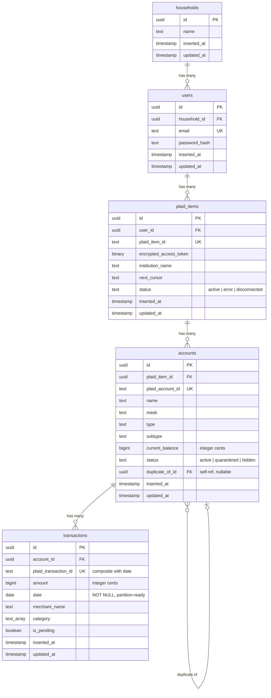

# Database Schema

## Entity-Relationship Diagram

## Domain Organization

| Ash Domain | Resource | Table |
|---|---|---|
| `FinanceSmith.Identity` | Household | `households` |
| `FinanceSmith.Identity` | User | `users` |
| `FinanceSmith.Banking` | PlaidItem | `plaid_items` |
| `FinanceSmith.Banking` | Account | `accounts` |
| `FinanceSmith.Banking` | Transaction | `transactions` |

## Foreign Key Cascade Rules

| FK Column | On Delete | Rationale |
|---|---|---|
| `users.household_id` | RESTRICT | Must explicitly remove users before deleting a household |
| `plaid_items.user_id` | CASCADE | Deleting a user removes all their Plaid connections |
| `accounts.plaid_item_id` | CASCADE | Revoking a Plaid item removes its accounts |
| `accounts.duplicate_of_id` | SET NULL | Removing the primary account clears the link |
| `transactions.account_id` | CASCADE | Transactions live and die with their account |

## Index Summary

| Table | Index | Type | Purpose |
|---|---|---|---|
| `users` | `email` | unique | Identity lookup |
| `users` | `household_id` | btree | FK join performance |
| `plaid_items` | `plaid_item_id` | unique | Identity lookup |
| `plaid_items` | `user_id` | btree | FK join performance |
| `accounts` | `plaid_account_id` | unique | Identity lookup |
| `accounts` | `plaid_item_id` | btree | FK join performance |
| `accounts` | `duplicate_of_id` | btree | FK join performance |
| `accounts` | `(plaid_item_id, status)` | composite | ETL quarantine queries |
| `transactions` | `(plaid_transaction_id, date)` | unique | Identity lookup, partition-ready |
| `transactions` | `account_id` | btree | FK join performance |
| `transactions` | `(account_id, date)` | composite | Date-range analytics |
| `transactions` | `account_id WHERE is_pending` | partial | Sync reconciliation |

## Encryption

The `plaid_items.access_token` field is encrypted at rest using AshCloak + Cloak (AES-256-GCM). The plaintext attribute `access_token` is transparently encrypted/decrypted; the database stores only the `encrypted_access_token` binary column. The encryption key is read from the `CLOAK_KEY` environment variable.

## Partition Readiness

The `transactions` table is structured for future range partitioning by `date`:
- `date` is NOT NULL (required for a partition key)
- The unique constraint includes `date` (required by PostgreSQL for partitioned unique indexes)
- No partitioning is active yet; it can be enabled via `create_table_options: "PARTITION BY RANGE (date)"` when volume warrants it
