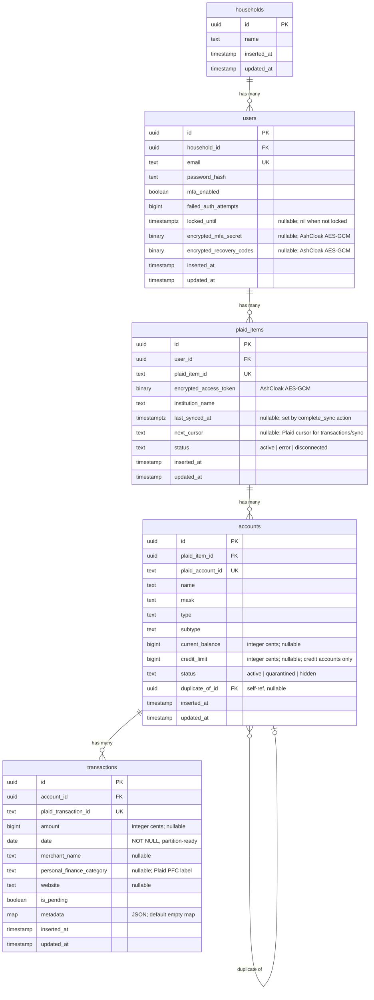

# Database Schema

## PostgreSQL schemas

All application tables live in the **`core`** schema. The `machine` schema is reserved for Oban job tables (prefix configured in `config/config.exs`). The `analytics` schema is created by migrations but contains no tables yet.

## Entity-Relationship Diagram



## Domain Organization

| Ash Domain | Resource | Table |
|---|---|---|
| `FinanceSmith.Identity` | Household | `core.households` |
| `FinanceSmith.Identity` | User | `core.users` |
| `FinanceSmith.Banking` | PlaidItem | `core.plaid_items` |
| `FinanceSmith.Banking` | Account | `core.accounts` |
| `FinanceSmith.Banking` | Transaction | `core.transactions` |

## Foreign Key Cascade Rules

| FK Column | On Delete | Rationale |
|---|---|---|
| `users.household_id` | RESTRICT | Must explicitly remove users before deleting a household |
| `plaid_items.user_id` | CASCADE | Deleting a user removes all their Plaid connections |
| `accounts.plaid_item_id` | CASCADE | Revoking a Plaid item removes its accounts |
| `accounts.duplicate_of_id` | SET NULL | Removing the primary account clears the deduplication link |
| `transactions.account_id` | CASCADE | Transactions live and die with their account |

## Index Summary

| Table | Index | Type | Purpose |
|---|---|---|---|
| `users` | `email` | unique | Identity lookup |
| `users` | `household_id` | btree | FK join performance |
| `plaid_items` | `plaid_item_id` | unique | Identity lookup |
| `plaid_items` | `user_id` | btree | FK join performance |
| `accounts` | `plaid_account_id` | unique | Identity lookup |
| `accounts` | `plaid_item_id` | btree | FK join performance |
| `accounts` | `duplicate_of_id` | btree | FK join performance |
| `accounts` | `(plaid_item_id, status)` | composite | ETL quarantine queries |
| `transactions` | `plaid_transaction_id` | unique | Identity lookup (single-column; date dropped after migration) |
| `transactions` | `account_id` | btree | FK join performance |
| `transactions` | `(account_id, date)` | composite | Date-range analytics |
| `transactions` | `(date, amount)` | composite | Chart and aggregate queries |
| `transactions` | `account_id WHERE is_pending` | partial | Sync reconciliation |
| `transactions` | `metadata` | GIN | JSON metadata search |
| `transactions` | `(account_id, personal_finance_category)` | composite | Category filter performance |
| `transactions` | `(account_id, personal_finance_category) WHERE amount > 0` | partial composite | Outflow-by-category aggregates |

## Encryption

The `plaid_items.encrypted_access_token` column stores the Plaid `access_token` encrypted with AshCloak + Cloak (AES-256-GCM). The plaintext attribute `access_token` is transparently encrypted/decrypted; the database only ever sees the binary ciphertext. The encryption key is read from the `CLOAK_KEY` environment variable via `FinanceSmith.Vault`.

The `users` table stores TOTP MFA state in `encrypted_mfa_secret` and `encrypted_recovery_codes`, encrypted with the same vault.

## One-off maintenance scripts

Scripts under `priv/repo/scripts/` are run with `mix run` against the configured database. **Always dry-run first** and review output before passing `--execute`.

| Script | Purpose |
|---|---|
| `cleanup_duplicate_accounts.exs` | Detects Plaid reconnect duplicates (same user, institution, mask, subtype across **different** `plaid_item_id`s), sets `duplicate_of_id` on newer rows, and bulk-deletes their transactions. Idempotent. |
| `cleanup_duplicates.exs` | Cleans pending/posted transaction orphans from sync edge cases (separate from account deduplication). |

### Recommended order

1. **`cleanup_duplicate_accounts.exs`** (dry run, then `--execute` if groups look correct) — fixes account-level double connections and removes duplicate-account transaction rows.
2. **`cleanup_duplicates.exs`** (if needed) — pending/posted orphan cleanup after account dedup is stable.

### Deploying duplicate-account handling

1. **Deploy application code** — safe at any time; `TransactionProcessor` uses the default `:read` action (no duplicate-account filter) so legacy pending rows on soft-linked accounts remain visible until cleanup.
2. **Run `cleanup_duplicate_accounts.exs`** — dry run, then `--execute` when groups look correct. Sets `duplicate_of_id` and removes redundant transactions on duplicate rows.
3. **Optionally run `cleanup_duplicates.exs`** — pending/posted orphan cleanup after account dedup is stable.

**Why run cleanup:** data hygiene and UI consistency (KPIs and `:list` / `:for_chart` already exclude duplicate-account rows). Cleanup is not required for processor correctness after the scoped transaction read filter.

**Legacy note:** If an environment deployed a build that applied the duplicate-account filter on **all** transaction reads (global preparation) before running account cleanup, run `cleanup_duplicate_accounts.exs --execute` immediately. Until duplicate-account transactions are removed, pending→posted resolution can fail for those rows.

### `cleanup_duplicate_accounts.exs`

```bash
# Dry run (default) — lists groups and counts only
mix run priv/repo/scripts/cleanup_duplicate_accounts.exs

# Apply changes
mix run priv/repo/scripts/cleanup_duplicate_accounts.exs --execute
```

Discovery skips accounts that already have `duplicate_of_id`, lack a mask, or belong to a Plaid item with a null `institution_name`. Groups must include accounts from more than one Plaid item (same-item collisions are not deduped).

## Partition Readiness

The `transactions` table is structured for future range partitioning by `date`:
- `date` is NOT NULL (required for a partition key)
- The unique constraint is on `plaid_transaction_id` alone (as of migration `20260418215004`), which is compatible with future partitioned unique indexes
- No partitioning is active yet; it can be enabled via `create_table_options: "PARTITION BY RANGE (date)"` when volume warrants it
